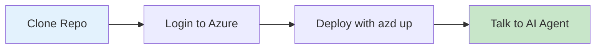
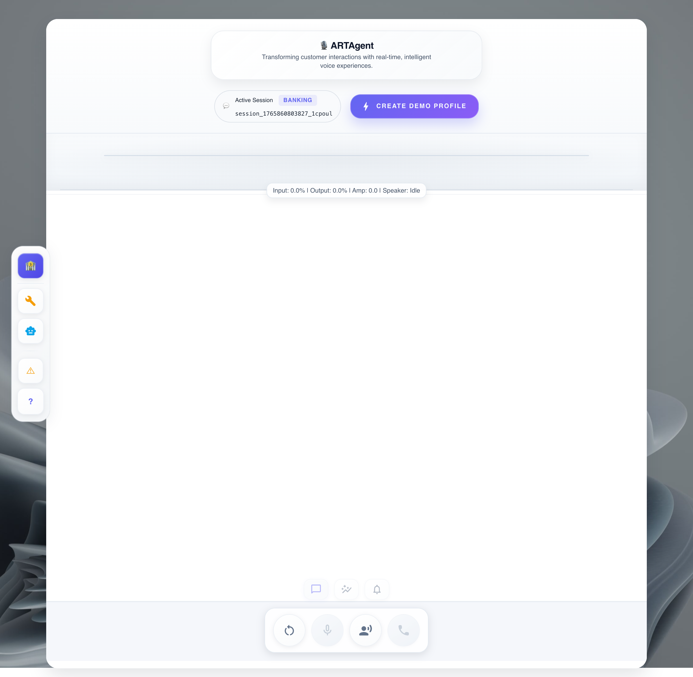
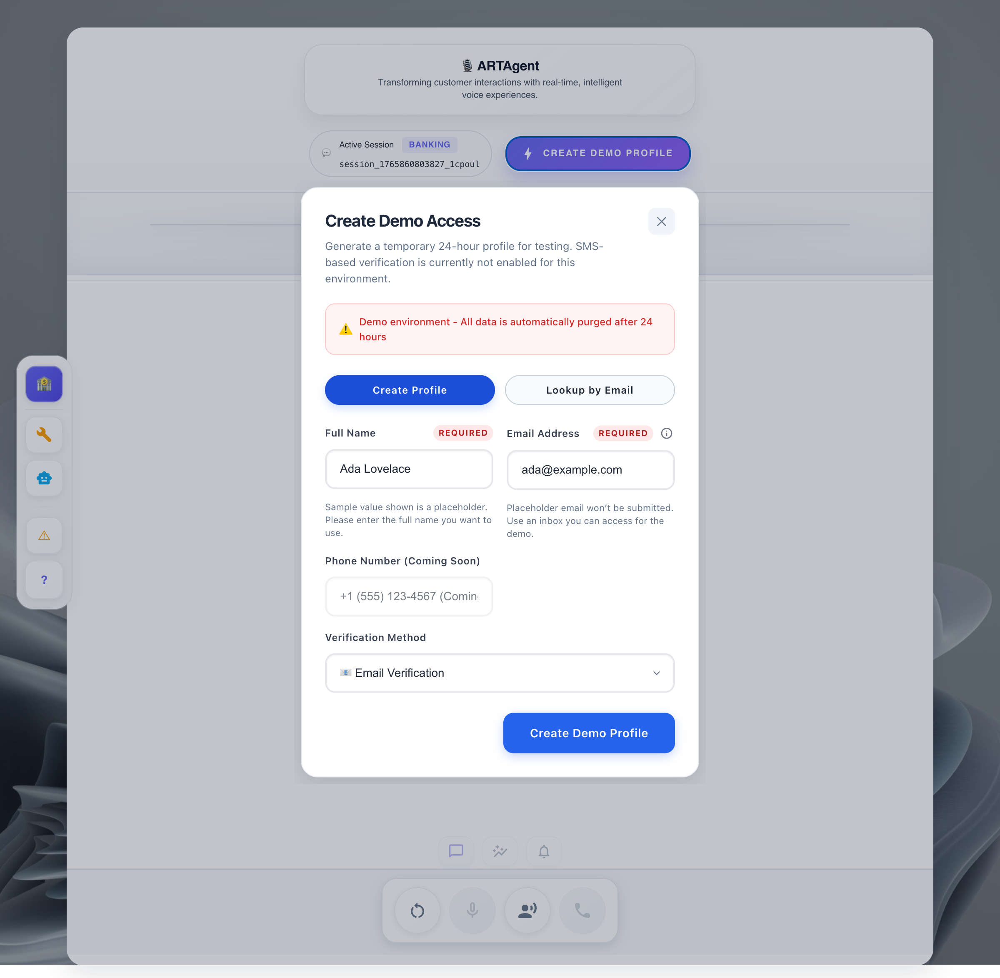
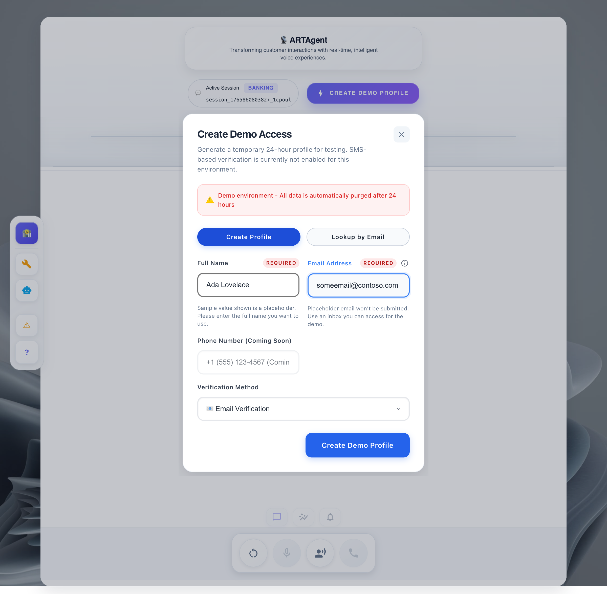
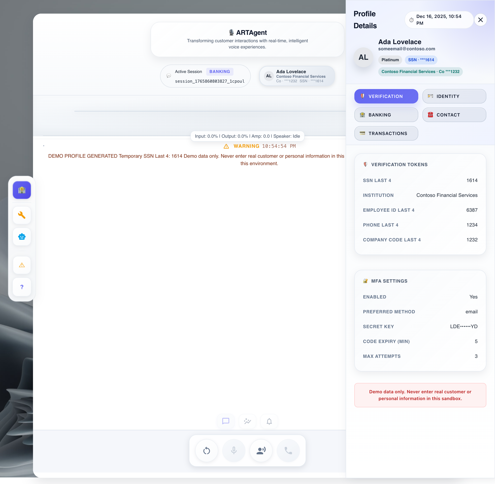
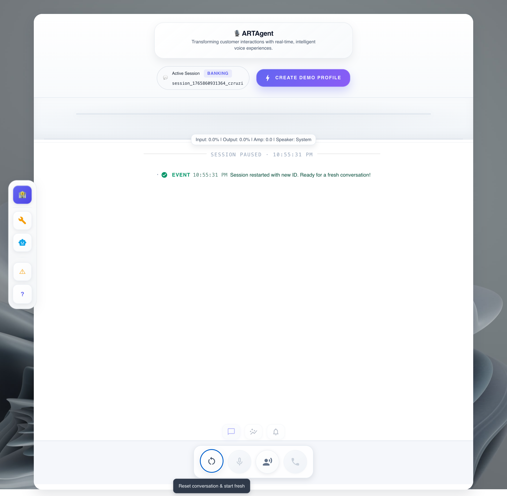
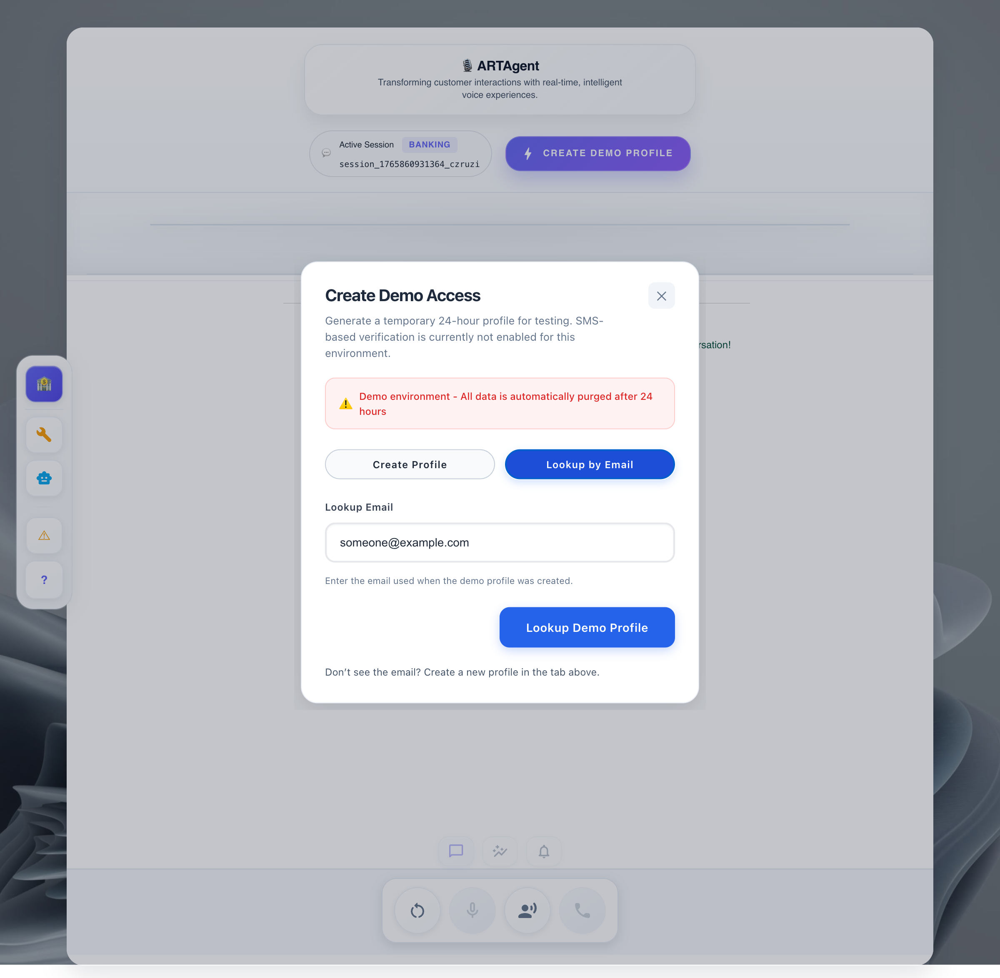
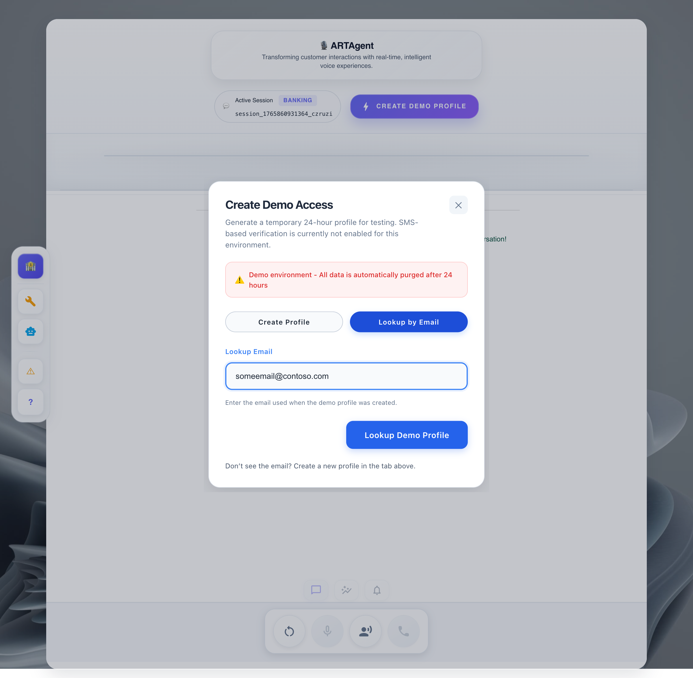
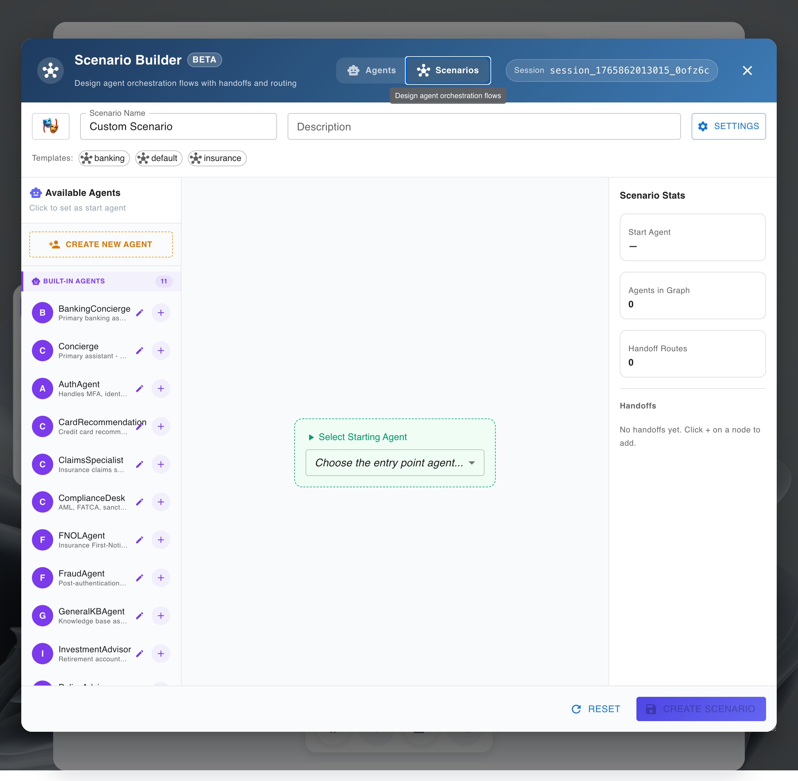
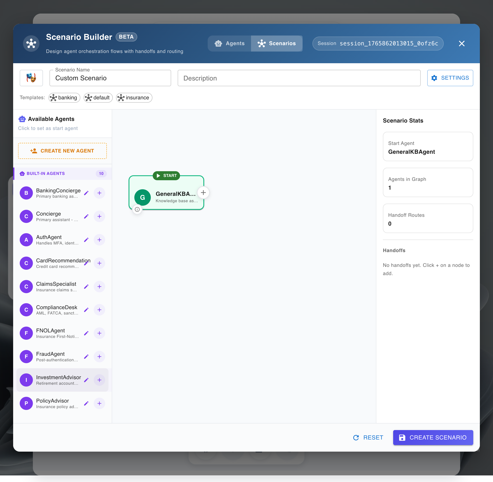

# :material-rocket-launch: Quickstart

!!! success "From Zero to Running Voice Agent in 15 Minutes"
    This guide gets you from clone to a working voice agent as fast as possible.

---

## :material-timer: What You'll Accomplish



| Step | Time | What Happens |
|------|------|--------------|
| Clone & Login | 2 min | Get the code, authenticate |
| Deploy | 12 min | Azure resources + app deployment |
| Test | 1 min | Open browser, start talking |

---

## :material-clipboard-check: Before You Start

!!! warning "Prerequisites Required"
    Make sure you've completed the [Prerequisites](prerequisites.md) first:
    
    - [x] Azure CLI installed and logged in
    - [x] Azure Developer CLI installed
    - [x] Docker running
    - [x] Azure subscription with Contributor access

---

## :material-numeric-1-circle: Clone the Repository

```bash
git clone https://github.com/Azure-Samples/art-voice-agent-accelerator.git
cd art-voice-agent-accelerator
```

---

## :material-numeric-2-circle: Login to Azure

```bash
# Login to Azure CLI (opens browser)
az login

# Login to Azure Developer CLI
azd auth login
```

---

## :material-numeric-3-circle: Deploy Everything

```bash
azd up
```

!!! info "What `azd up` Does"
    This single command handles everything:
    
    1. **Creates Azure resources** (~12 min)
        - Azure OpenAI (GPT-4o)
        - Azure Speech Services
        - Azure Communication Services
        - Cosmos DB, Redis, Storage
        - Container Apps (frontend + backend)
    
    2. **Builds and deploys** your application
    
    3. **Generates `.env.local`** for local development

### During Deployment

You'll be prompted for:

| Prompt | What to Enter |
|--------|---------------|
| Environment name | A short name (e.g., `dev`, `myname-dev`) |
| Azure subscription | Select from list |
| Azure location | Choose a region (e.g., `eastus`, `westus2`) |
| Remote state storage | Press `Y` (recommended) |

### Deployment Hooks

The deployment runs automated scripts before and after provisioning Azure resources. Expand the sections below to see exactly what each script creates and configures.

??? abstract "Pre-Provisioning Script (`preprovision.sh`)"
    
    This script runs **before** Azure resources are created to validate your environment and set up prerequisites.
    
    === ":material-check-circle: Validation Checks"
        
        | Check | Description |
        |-------|-------------|
        | CLI Tools | Validates `az`, `azd`, `jq`, and `docker` are installed |
        | Azure Auth | Confirms you're logged into Azure CLI |
        | Subscription | Sets `ARM_SUBSCRIPTION_ID` for Terraform |
    
    === ":material-package-variant: Extensions Installed"
        
        The script automatically installs these Azure CLI extensions:
        
        ```bash
        az extension add --name quota --upgrade
        az extension add --name redisenterprise --upgrade  
        az extension add --name cosmosdb-preview --upgrade
        ```
    
    === ":material-cloud-check: Resource Providers"
        
        Registers required Azure resource providers:
        
        - `Microsoft.Compute`
        - `Microsoft.ContainerService`
        - `Microsoft.CognitiveServices`
        - `Microsoft.Communication`
        - `Microsoft.DocumentDB`
        - `Microsoft.Cache`
        - `Microsoft.Storage`
        - `Microsoft.App`
        - `Microsoft.OperationalInsights`
    
    === ":material-map-marker-check: Region Availability"
        
        Verifies the selected Azure region supports:
        
        - Azure OpenAI
        - Azure Speech Services
        - Azure Communication Services
        - Container Apps
    
    === ":material-database-cog: Terraform State"
        
        Sets up remote state storage in Azure for Terraform:
        
        - Creates a storage account for state files
        - Configures state locking with blob leases

??? abstract "Post-Provisioning Script (`postprovision.sh`)"
    
    This script runs **after** Azure resources are created to configure your application.
    
    === ":material-database-plus: Cosmos DB Initialization"
        
        Creates the initial database structure:
        
        | Container | Purpose |
        |-----------|---------|
        | `sessions` | Active call session data |
        | `transcripts` | Conversation transcripts |
        | `profiles` | User/agent profiles |
        | `scenarios` | Agent scenario configurations |
    
    === ":material-phone-plus: Phone Number Configuration"
        
        !!! note "Interactive Prompt"
            You'll be asked if you want to configure a phone number for PSTN calls.
        
        - **Yes**: Guides you through phone number purchase/assignment
        - **No**: Skip for browser-only voice (you can add later)
    
    === ":material-cog-sync: App Configuration Sync"
        
        Updates Azure App Configuration with:
        
        - Backend and frontend URLs
        - Service endpoints
        - Feature flags
        - Connection strings (references to Key Vault)
    
    === ":material-file-document-edit: Local Development File"
        
        Generates `.env.local` with all required environment variables:
        
        ```bash
        # Generated by postprovision.sh
        AZURE_OPENAI_ENDPOINT=https://...
        AZURE_SPEECH_REGION=eastus
        COSMOS_DB_ENDPOINT=https://...
        # ... additional variables
        ```
        
        !!! tip "Ready for Local Dev"
            This file enables immediate local development without manual configuration.

### Deployment Output

When complete, you'll see:

```
Deploying services (azd deploy)

  (✓) Done: Deploying service rtaudio-client
  (✓) Done: Deploying service rtaudio-server

SUCCESS: Your application was deployed to Azure!

  Frontend: https://ca-frontend-xxxxx.azurecontainerapps.io
  Backend:  https://ca-backend-xxxxx.azurecontainerapps.io
```

---

## :material-numeric-4-circle: Open Your Voice Agent

1. **Copy the Frontend URL** from the deployment output
2. **Open it in your browser**
3. **Allow microphone access** when prompted
4. **Start talking!** 🎤

!!! success "You're Done!"
    Your AI voice agent is now running. Try asking it questions about insurance, account balances, or just have a conversation.

---

## :material-account-plus: Create a Demo Profile

Before testing personalized conversations, create a demo profile with synthetic customer data that agents use for context-aware interactions.

=== "Step 1: Open Profile Dialog"

    From the home screen, click the **:material-lightning-bolt: Create Demo Profile** button in the top navigation.
    
    <figure markdown="span">
      { loading=lazy }
      <figcaption>Click "Create Demo Profile" button</figcaption>
    </figure>

=== "Step 2: Fill Profile Form"

    The **Create Demo Access** dialog appears. Fill in the required fields:
    
    <figure markdown="span">
      { loading=lazy }
      <figcaption>Create Demo Access dialog</figcaption>
    </figure>
    
    | Field | Description |
    |-------|-------------|
    | **Full Name** | Your display name for the demo |
    | **Email Address** | Use a real email if testing MFA verification |
    | **Verification Method** | Choose Email or SMS for MFA codes |

=== "Step 3: Complete Form"

    Enter your details and select your preferred verification method.
    
    <figure markdown="span">
      { loading=lazy }
      <figcaption>Completed profile form</figcaption>
    </figure>
    
    !!! warning "Use Real Email for MFA Testing"
        If you want to test multi-factor authentication tools, provide your actual email address. The system sends real 6-digit verification codes you'll read back to the agent.

=== "Step 4: View Profile"

    Click **Create Demo Profile** to generate your synthetic customer data. The profile panel shows your generated data including verification tokens and MFA settings.
    
    <figure markdown="span">
      { loading=lazy }
      <figcaption>Profile created with verification tokens</figcaption>
    </figure>
    
    !!! info "Profile Expiration"
        Demo profiles automatically expire after **24 hours**. All data is synthetic and safe for demos.

=== "Step 5: Reset Session (Optional)"

    To start a fresh conversation, click the **reset button** :material-refresh: in the bottom toolbar.
    
    <figure markdown="span">
      { loading=lazy }
      <figcaption>Reset conversation and start fresh</figcaption>
    </figure>

=== "Lookup Existing Profile"

    Already created a profile? Switch to the **Lookup by Email** tab and enter the email used during creation.
    
    <figure markdown="span">
      { loading=lazy }
      <figcaption>Lookup by Email tab</figcaption>
    </figure>
    
    <figure markdown="span">
      { loading=lazy }
      <figcaption>Enter email to find existing profile</figcaption>
    </figure>

---

## :material-help-circle: Quick Troubleshooting

??? failure "Deployment failed with permission error"
    You need **Contributor** access on your Azure subscription.
    
    ```bash
    # Check your current permissions
    az role assignment list --assignee $(az account show --query user.name -o tsv)
    ```
    
    Contact your Azure admin if you don't have sufficient permissions.

??? failure "Docker is not running"
    Start Docker Desktop before running `azd up`.
    
    ```bash
    # Verify Docker is running
    docker info
    ```

??? failure "azd up hangs or times out"
    Some Azure resources take time to provision. If it times out:
    
    ```bash
    # Resume deployment
    azd provision
    azd deploy
    ```

??? question "How do I see what was created?"
    ```bash
    # List all resources
    azd env get-values
    
    # Or check in Azure Portal
    # Search for your environment name
    ```

---

## :material-movie: Build Your First Agent

Once your deployment is complete, use the Agent Builder to create and run your first agent.

=== "Step 1: Open Agent Builder"

    From the home screen, click the **wrench icon** :material-wrench: on the left toolbar to open the Agent Editor.
    
    <figure markdown="span">
      { loading=lazy }
      <figcaption>Home screen - click the wrench icon on the left toolbar</figcaption>
    </figure>
    
    <figure markdown="span">
      { loading=lazy }
      <figcaption>Agent Builder interface</figcaption>
    </figure>

=== "Step 2: Choose Template"

    Pick a starter template to accelerate setup (recommended for first-time use). Confirm the template details and proceed.
    
    <figure markdown="span">
      { loading=lazy }
      <figcaption>Selecting a template</figcaption>
    </figure>

=== "Step 3: Configure Basics"

    Enter a name and short description for your agent. Keep defaults for optional fields on your first run; you can refine later.
    
    !!! tip "Naming Convention"
        Use descriptive names like `insurance-claims-agent` or `customer-support-v1`.

=== "Step 4: Create Agent"

    Click **Create** to scaffold your agent from the template. Wait for confirmation that resources and defaults are ready.
    
    !!! info "Updating Existing Agents"
        If you create an agent with the same name as an existing one, it will **update** the existing agent rather than creating a duplicate.

=== "Step 5: Verify & Test"

    After creation, you'll land on the agent's overview page. Follow the prompts to start your agent and validate the health/status endpoints.
    
    !!! success "Ready to Iterate"
        Tweak prompts and parameters, then re-run and observe results. Commit changes as you validate behavior.

!!! tip "Images not rendering?"
    Verify relative paths from `docs/getting-started` or open the repo in VS Code's Markdown preview.

---

## :material-script-text: Configure Your First Scenario

Scenarios define what conversations your agent can handle. Create one to customize your agent's behavior.

=== "Step 1: Access Scenarios"

    From the Agent Builder, select **Scenario** from the tabs at the top of the window. Then click **Create New Scenario** or select an existing one to edit.
    
    <figure markdown="span">
      { loading=lazy }
      <figcaption>Select Scenario tab at the top of the Agent Builder</figcaption>
    </figure>

=== "Step 2: Open Builder"

    The scenario builder interface appears with tools and configuration options. Start with a blank scenario or use a pre-built template.
    
    <figure markdown="span">
      { loading=lazy }
      <figcaption>Scenario builder interface</figcaption>
    </figure>

=== "Step 3: Define Knowledge Base"

    Add a general knowledge base or attach specific documents/instructions. This context powers the agent's responses.
    
    <figure markdown="span">
      { loading=lazy }
      <figcaption>Configuring the knowledge base</figcaption>
    </figure>

=== "Step 4: Configure Flow"

    Set greetings, decision logic, and handoff rules (e.g., transfer to human if unresolved).
    
    | Component | Purpose |
    |-----------|---------|
    | **Greeting** | Initial message when call connects |
    | **Decision Logic** | Routes based on caller intent |
    | **Handoff Rules** | Escalation to human agents |

=== "Step 5: Connected Auth (Optional)"

    Integrate backend systems for identity verification and account lookups.
    
    <figure markdown="span">
      { loading=lazy }
      <figcaption>Connected authentication setup</figcaption>
    </figure>

=== "Step 6: Fraud Detection (Optional)"

    Run parallel workflows for validation or fraud checks alongside the conversation.
    
    <figure markdown="span">
      { loading=lazy }
      <figcaption>Parallel processing configuration</figcaption>
    </figure>

=== "Step 7: Create & Test"

    Click **Create Scenario** to save your configuration. Then start a voice conversation to test:
    
    | Mode | Description |
    |------|-------------|
    | **VoiceLive** | Real-time streaming with lowest latency |
    | **Speech Cascade** | Traditional STT → LLM → TTS pipeline |
    
    Verify the agent greets you and responds correctly using the KB.
    
    !!! info "Updating Existing Scenarios"
        If you create a scenario with the same name as an existing one, it will **update** the existing scenario rather than creating a duplicate. This makes it easy to iterate on your configurations.

!!! tip "Start Simple"
    Begin with a greeting + KB + handoff rule. Add connected auth and fraud detection as you scale and iterate.

---

## :material-arrow-right: Next Steps

| What You Want | Guide |
|---------------|-------|
| **Run locally** for development | [Local Development](local-development.md) |
| **Try the full demo** with agents | [Demo Guide](demo-guide.md) |
| **Understand the architecture** | [Architecture Overview](../architecture/README.md) |
| **Add a phone number** for PSTN calls | [Phone Number Setup](../deployment/phone-number-setup.md) |
| **Customize agents** | [Agent Framework](../architecture/agents/README.md) |

---

## :material-delete: Cleanup

When you're done, remove all Azure resources:

```bash
azd down --force --purge
```

!!! warning "This deletes everything"
    This command removes all Azure resources created by `azd up`. Your code remains intact.
