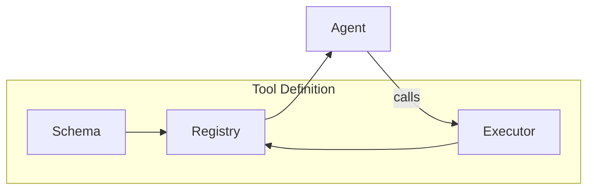

# Tools Guide

Tools are the functions that agents can call to perform actions or retrieve information. This guide explains how to define, register, and use tools in the voice agent framework.

## Overview

Tools are defined with three components:

1. **Schema** - OpenAI-compatible function definition
2. **Executor** - Async Python function that implements the tool
3. **Registration** - Connects the schema and executor to the registry



## Tool Structure

### 1. Schema

The schema defines what the tool does and what parameters it accepts. It follows the [OpenAI function calling format](https://platform.openai.com/docs/guides/function-calling):

```python
get_account_balance_schema: dict[str, Any] = {
    "name": "get_account_balance",
    "description": (
        "Get the current balance for a customer's account. "
        "Use this when the customer asks about their balance."
    ),
    "parameters": {
        "type": "object",
        "properties": {
            "client_id": {
                "type": "string",
                "description": "Customer identifier from verification"
            },
            "account_type": {
                "type": "string",
                "enum": ["checking", "savings", "credit"],
                "description": "Type of account to check"
            },
        },
        "required": ["client_id"],
    },
}
```

!!! tip "Schema Best Practices"
    - **Be descriptive**: The description helps the LLM decide when to use the tool
    - **Include usage hints**: Explain *when* the agent should call this tool
    - **Use enums**: Constrain string parameters where possible
    - **Mark required fields**: Only mark truly required parameters

### 2. Executor

The executor is an async function that performs the actual work:

```python
async def get_account_balance(args: dict[str, Any]) -> dict[str, Any]:
    """Get account balance for a customer."""
    client_id = (args.get("client_id") or "").strip()
    account_type = args.get("account_type", "checking")
    
    if not client_id:
        return {
            "success": False,
            "message": "client_id is required."
        }
    
    # Your implementation here
    balance = await fetch_balance_from_database(client_id, account_type)
    
    return {
        "success": True,
        "balance": balance,
        "account_type": account_type,
        "message": f"Your {account_type} balance is ${balance:,.2f}"
    }
```

!!! warning "Always Use Async"
    Tool executors should always be `async def`. The framework handles both sync and async functions, but async is preferred for consistency.

### 3. Registration

Register the tool by calling `register_tool()`:

```python
from apps.artagent.backend.registries.toolstore.registry import register_tool

register_tool(
    name="get_account_balance",
    schema=get_account_balance_schema,
    executor=get_account_balance,
    tags={"banking", "accounts"},  # Optional categorization
)
```

## Complete Example

Here's a complete tool file:

```python
"""
Account Tools
=============

Tools for account balance and transaction inquiries.
"""

from __future__ import annotations

from typing import Any

from apps.artagent.backend.registries.toolstore.registry import register_tool
from utils.ml_logging import get_logger

logger = get_logger("agents.tools.accounts")


# ═══════════════════════════════════════════════════════════════════════════════
# SCHEMAS
# ═══════════════════════════════════════════════════════════════════════════════

get_account_balance_schema: dict[str, Any] = {
    "name": "get_account_balance",
    "description": (
        "Get the current balance for a customer's account. "
        "Use when the customer asks about their balance."
    ),
    "parameters": {
        "type": "object",
        "properties": {
            "client_id": {
                "type": "string",
                "description": "Customer identifier"
            },
        },
        "required": ["client_id"],
    },
}


# ═══════════════════════════════════════════════════════════════════════════════
# EXECUTORS
# ═══════════════════════════════════════════════════════════════════════════════

async def get_account_balance(args: dict[str, Any]) -> dict[str, Any]:
    """Get account balance for a customer."""
    client_id = (args.get("client_id") or "").strip()
    
    if not client_id:
        return {"success": False, "message": "client_id is required."}
    
    logger.info("Fetching balance for client: %s", client_id)
    
    # Mock implementation - replace with real database call
    balance = 5432.10
    
    return {
        "success": True,
        "balance": balance,
        "message": f"Your checking balance is ${balance:,.2f}"
    }


# ═══════════════════════════════════════════════════════════════════════════════
# REGISTRATION
# ═══════════════════════════════════════════════════════════════════════════════

register_tool(
    "get_account_balance",
    get_account_balance_schema,
    get_account_balance,
    tags={"banking"},
)
```

## Handoff Tools

Handoff tools are special tools that transfer the conversation to another agent. They return a specific payload that the orchestrator recognizes:

```python
handoff_fraud_agent_schema: dict[str, Any] = {
    "name": "handoff_fraud_agent",
    "description": (
        "Transfer to Fraud Agent for suspicious activity investigation. "
        "Use when customer reports fraud or unauthorized charges."
    ),
    "parameters": {
        "type": "object",
        "properties": {
            "client_id": {"type": "string", "description": "Customer identifier"},
            "reason": {"type": "string", "description": "Why fraud is suspected"},
        },
        "required": ["client_id"],
    },
}

async def handoff_fraud_agent(args: dict[str, Any]) -> dict[str, Any]:
    """Transfer to fraud specialist."""
    return {
        "handoff": True,                      # Signals handoff to orchestrator
        "target_agent": "FraudAgent",         # Agent to transfer to
        "message": "",                        # Empty = silent handoff
        "handoff_summary": "Fraud investigation requested",
        "handoff_context": {
            "client_id": args.get("client_id"),
            "reason": args.get("reason"),
        },
    }

# Register with is_handoff=True
register_tool(
    "handoff_fraud_agent",
    handoff_fraud_agent_schema,
    handoff_fraud_agent,
    is_handoff=True,  # Important!
    tags={"handoff"},
)
```

!!! note "Silent Handoffs"
    Handoffs should be **silent** - the agent calls the tool immediately without saying "Let me transfer you". The target agent greets the customer.

## Tool Loading

Tools are loaded at application startup via `initialize_tools()`:

```python
from apps.artagent.backend.registries.toolstore import initialize_tools

# Call once at startup
count = initialize_tools()
print(f"Loaded {count} tools")
```

The loader imports all tool modules in `toolstore/`, triggering their `register_tool()` calls.

## Using Tools in Agents

Agents reference tools by name in their `agent.yaml`:

```yaml
# agents/concierge/agent.yaml
name: Concierge
tools:
  - verify_client_identity
  - get_account_balance
  - get_recent_transactions
  - handoff_fraud_agent
```

The framework resolves these names to full tool definitions at runtime:

```python
from apps.artagent.backend.registries.agentstore import discover_agents

agents = discover_agents()
concierge = agents["Concierge"]

# Get OpenAI-compatible tool schemas
tools = concierge.get_tools()
# Returns: [{"type": "function", "function": {...}}, ...]

# Execute a tool
result = await concierge.execute_tool("get_account_balance", {"client_id": "123"})
```

## Registry API Reference

| Function | Description |
|----------|-------------|
| `register_tool(name, schema, executor, *, is_handoff=False, tags=None)` | Register a new tool |
| `initialize_tools()` | Load all tool modules |
| `get_tools_for_agent(tool_names)` | Get schemas for specific tools |
| `execute_tool(name, args)` | Execute a tool by name |
| `list_tools(*, tags=None, handoffs_only=False)` | List registered tool names |
| `is_handoff_tool(name)` | Check if tool triggers handoff |

## File Organization

```
toolstore/
├── __init__.py          # Exports
├── registry.py          # Core registration logic
├── auth.py              # Authentication tools
├── handoffs.py          # Handoff tools
├── banking/             # Domain-specific tools
│   ├── banking.py       # Account, transactions
│   └── investments.py   # Investment tools
└── insurance/           # Insurance tools
    ├── fnol.py          # First Notice of Loss
    └── policy.py        # Policy management
```

## Next Steps

- [Agents Guide](agents.md) - Learn how agents use tools
- [Scenarios Guide](scenarios.md) - Configure tool availability per scenario
