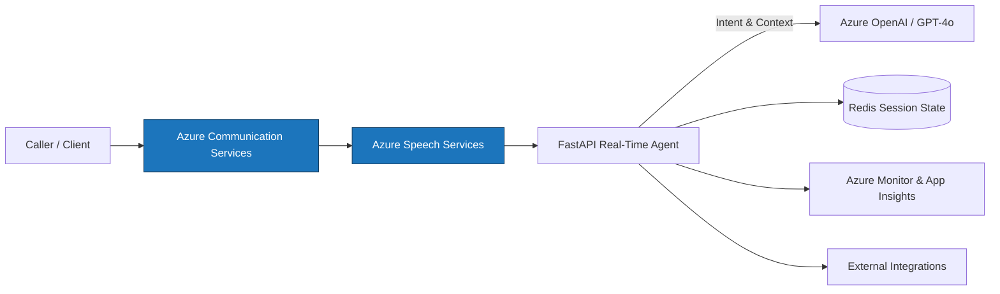

# Real-Time Voice Agent Documentation Hub

This site brings together everything you need to deploy, operate, and extend the Azure-based Real-Time Voice Agent. Use the map below to jump into the areas most relevant to your work.

## Documentation Map

- **Quick Start & Setup**
  - [Quick Start Guide](getting-started/quickstart.md)
  - [Local Development Playbook](quickstart-local-development.md)
  - [Installation Checklist](getting-started/installation.md)
- **Architecture & Flows**
  - [Architecture Deep Dive](Architecture.md)
  - [Data Architecture](DataArchitecture.md)
  - [Integration Points](IntegrationPoints.md)
  - [ACS Barge-In Flow](ACSBargeInFlow.md)
- **Operations & Delivery**
  - [Deployment Guide](DeploymentGuide.md)
  - [CI/CD Runbook](CICDGuide.md)
  - [Path to Production](PathToProduction.md)
  - [Application Insights](ApplicationInsights.md)
- **Security & Access**
  - [Auth for HTTP and WebSocket Calls](AuthForHTTPandWSS.md)
  - [WebSocket Authentication](WebsocketAuth.md)
- **Testing & Load**
  - [Load Testing Strategy](LoadTesting.md)
  - [Troubleshooting Guide](Troubleshooting.md)
- **Industry Scenarios**
  - [Healthcare Playbooks](HealthcareUsecases.md)

## Diagram Highlights

- Production reference: [Architecture Deep Dive – Production Deployment](Architecture.md#production-deployment-architecture) (image: `assets/RTAudio.v0.png`)
- Data lifecycle: [Data Architecture – Event Pipeline](DataArchitecture.md#event-driven-data-pipeline) with interactive Mermaid sequence diagrams
- Contact center routing: [ACS Barge-In Flow](ACSBargeInFlow.md) featuring step-by-step diagrams and Mermaid flows
- Authentication flows: [Auth for HTTP and WSS](AuthForHTTPandWSS.md#end-to-end-authentication-flow) detailing OAuth and shared access tokens

## Architecture at a Glance

The architecture section contains comprehensive Mermaid diagrams for every critical workflow. When rendered on GitHub Pages, these charts remain interactive—hover to highlight paths or copy the diagram source to integrate into your own documentation.

## Next Steps

If you are new to the project, start with the [Quick Start Guide](getting-started/quickstart.md) and then dive into the [Architecture Deep Dive](Architecture.md) for system context. Platform operators should review the [Deployment Guide](DeploymentGuide.md) and [Troubleshooting](Troubleshooting.md) playbooks, while solution teams can jump into the [Integration Points](IntegrationPoints.md) and [Healthcare Playbooks](HealthcareUsecases.md) for domain-specific patterns.
