# Healthcare Voice Agent Scenario

This guide explains how to build a **Nurse Triage Scenario** — a multi-agent voice system designed for healthcare patient intake and symptom assessment. Unlike banking and insurance (which have pre-built scenarios), healthcare demonstrates how to **create a new scenario from scratch**.

!!! info "Build Your Own Scenario"
    Healthcare is a template for creating custom scenarios. Follow this guide to add a `healthcare` scenario to your scenariostore.

---

## Scenario Overview

The healthcare scenario demonstrates a **triage-first model** where a nurse AI performs symptom assessment and routes to specialists or escalates to human nurses when needed.

```mermaid
flowchart TD
    subgraph Patient["📞 Patient Call"]
        A[Patient calls triage line]
    end

    subgraph Triage["🩺 Triage Agent"]
        B[Verify patient identity]
        C[Symptom assessment]
        D[Search clinical KB]
        E{Urgency level?}
    end

    subgraph Routing["🔀 Routing"]
        F[Schedule appointment]
        G[Handoff to RN]
        H[Transfer to 911]
    end

    A --> B
    B --> C
    C --> D
    D --> E
    E -->|"ROUTINE"| F
    E -->|"URGENT"| G
    E -->|"EMERGENCY"| H

    classDef patient fill:#3498db,stroke:#2c3e50,color:#fff
    classDef triage fill:#2ecc71,stroke:#27ae60,color:#fff
    classDef routing fill:#e67e22,stroke:#d35400,color:#fff

    class A patient
    class B,C,D,E triage
    class F,G,H routing
```



---

## Key Differences from Banking & Insurance

| Aspect | Banking | Insurance | Healthcare |
|--------|---------|-----------|------------|
| **Entry Point** | Concierge (hub model) | AuthAgent (security-first) | NurseTriage (assessment-first) |
| **Primary Pattern** | Route to specialists | Verify then route | Assess then escalate |
| **Critical Path** | Investment advice | Claims processing | Emergency detection |
| **Escalation Target** | Compliance desk | Human agent | 911 / RN |
| **Context Sharing** | Full (personalization) | Partial (security) | Full (medical history) |

---

## Step 1: Create the Scenario Configuration

Create the scenario directory and configuration:

```bash
mkdir -p apps/artagent/backend/registries/scenariostore/healthcare
touch apps/artagent/backend/registries/scenariostore/healthcare/__init__.py
```

### Scenario YAML

Create `apps/artagent/backend/registries/scenariostore/healthcare/scenario.yaml`:

```yaml title="registries/scenariostore/healthcare/scenario.yaml"
# ═══════════════════════════════════════════════════════════════════════════════
# Healthcare Nurse Triage Scenario
# ═══════════════════════════════════════════════════════════════════════════════
# Triage-first model: assess symptoms, search clinical KB, route appropriately
# ═══════════════════════════════════════════════════════════════════════════════

name: healthcare
description: Nurse triage for symptom assessment and care routing

# Entry point - triage agent handles all incoming calls
start_agent: NurseTriage

# Agents in this scenario
agents:
  - NurseTriage        # Primary: symptom assessment and routing
  - SpecialistNurse    # Urgent cases requiring clinical expertise
  - AppointmentAgent   # Scheduling for routine cases

# Default handoff behavior
handoff_type: announced  # Healthcare prefers clear handoffs for safety

# ─────────────────────────────────────────────────────────────────────────────
# Handoff Routes
# ─────────────────────────────────────────────────────────────────────────────
handoffs:
  # NurseTriage routes based on urgency
  - from: NurseTriage
    to: SpecialistNurse
    tool: handoff_specialist_nurse
    type: announced           # Clear handoff for medical safety
    share_context: true       # Pass full symptom assessment

  - from: NurseTriage
    to: AppointmentAgent
    tool: handoff_appointment
    type: discrete            # Seamless for routine scheduling
    share_context: true

  # Specialist can return to triage or escalate
  - from: SpecialistNurse
    to: NurseTriage
    tool: handoff_triage
    type: discrete

# ─────────────────────────────────────────────────────────────────────────────
# Template Variables
# ─────────────────────────────────────────────────────────────────────────────
agent_defaults:
  institution_name: "Contoso Health"
  industry: "healthcare"
  hipaa_required: true
  region: "US"
```

---

## Scenario Components Explained

### 1. Entry Point: `start_agent`

```yaml
start_agent: NurseTriage
```

Every patient call begins with the **NurseTriage** agent, which performs:

1. **Identity verification** (HIPAA requirement)
2. **Symptom assessment** (structured questions)
3. **Knowledge base search** (clinical guidelines)
4. **Urgency routing** (ROUTINE → URGENT → EMERGENCY)

!!! warning "HIPAA Compliance"
    Healthcare scenarios must verify patient identity before discussing any medical information. The triage agent handles this as the first step.

### 2. Agent Selection: `agents`

```yaml
agents:
  - NurseTriage        # Entry + assessment
  - SpecialistNurse    # Urgent clinical cases
  - AppointmentAgent   # Routine scheduling
```

The healthcare scenario uses a minimal agent set focused on triage efficiency:

| Agent | Role | Urgency Level |
|-------|------|---------------|
| `NurseTriage` | Assess symptoms, detect emergencies | All |
| `SpecialistNurse` | Clinical expertise for urgent cases | URGENT |
| `AppointmentAgent` | Schedule routine follow-ups | ROUTINE |

!!! note "Emergency Handling"
    EMERGENCY cases don't route to another agent — they transfer directly to 911 via a tool call. This is a **tool-based transfer**, not an agent handoff.

### 3. Handoff Routes: `handoffs`

Healthcare uses primarily **announced** handoffs for medical safety and clarity:

```yaml
handoffs:
  - from: NurseTriage
    to: SpecialistNurse
    tool: handoff_specialist_nurse
    type: announced           # Patient knows they're speaking to specialist
    share_context: true       # Full symptom history transferred
```

#### Why Announced for Healthcare?

| Reason | Explanation |
|--------|-------------|
| **Medical Safety** | Patient knows who they're speaking with |
| **Trust** | Clear handoffs build confidence in care |
| **Documentation** | Explicit transitions are easier to audit |
| **Liability** | Clear chain of communication |

---

## Agent Graph Visualization

The healthcare scenario creates this routing graph:

```mermaid
flowchart LR
    subgraph Legend[" "]
        direction LR
        L1[Agent A] ==>|"🔔 ANNOUNCED"| L2[Agent B]
        L3[Agent C] -.->|"🔇 DISCRETE"| L4[Agent D]
    end

    subgraph Healthcare["Healthcare Scenario"]
        T["🩺 NurseTriage<br/>(entry point)"]
        S["👩‍⚕️ SpecialistNurse"]
        A["📅 AppointmentAgent"]
        
        T ==>|"🔔 announced<br/>handoff_specialist_nurse"| S
        T -.->|"🔇 discrete<br/>handoff_appointment"| A
        S -.->|"🔇 discrete<br/>handoff_triage"| T
    end
    
    T ==>|"🚨 EMERGENCY<br/>transfer_to_emergency"| E["🚑 911"]
    
    style T fill:#2ecc71,stroke:#27ae60,color:#fff
    style S fill:#3498db,stroke:#2980b9,color:#fff
    style A fill:#9b59b6,stroke:#8e44ad,color:#fff
    style E fill:#e74c3c,stroke:#c0392b,color:#fff
    style L1 fill:#fff,stroke:#999
    style L2 fill:#fff,stroke:#999
    style L3 fill:#fff,stroke:#999
    style L4 fill:#fff,stroke:#999
```



**Reading the Graph:**

| Line Style | Handoff Type | User Experience |
|------------|--------------|------------------|
| **Thick solid** (==>) | `announced` | Target agent greets patient explicitly |
| **Dashed** (-->) | `discrete` | Seamless transition, no greeting |

---

## Step 2: Create the Agents

### NurseTriage Agent

Create the agent directory:

```bash
mkdir -p apps/artagent/backend/registries/agentstore/nurse_triage
```

Create `apps/artagent/backend/registries/agentstore/nurse_triage/agent.yaml`:

```yaml title="agentstore/nurse_triage/agent.yaml"
# ═══════════════════════════════════════════════════════════════════════════════
# Nurse Triage Agent
# ═══════════════════════════════════════════════════════════════════════════════

name: NurseTriage
description: |
  AI nurse triage agent for symptom assessment, clinical guidance lookup,
  and appropriate routing to care resources.

greeting: |
  Hello, this is the nurse triage line at {{ institution_name | default('Contoso Health') }}.
  I'm here to help assess your symptoms and connect you with the right care.
  May I have your name and date of birth to get started?

return_greeting: |
  Welcome back. Is there anything else I can help you with regarding your health concern?

# ─────────────────────────────────────────────────────────────────────────────
# Handoff Configuration
# ─────────────────────────────────────────────────────────────────────────────
handoff:
  trigger: handoff_nurse_triage
  is_entry_point: true  # Starting agent for healthcare scenario

# ─────────────────────────────────────────────────────────────────────────────
# Voice Configuration
# ─────────────────────────────────────────────────────────────────────────────
voice:
  name: en-US-JennyNeural
  style: empathetic
  rate: "-5%"  # Slightly slower for clarity and calm

# ─────────────────────────────────────────────────────────────────────────────
# Tools
# ─────────────────────────────────────────────────────────────────────────────
tools:
  # Patient identity (HIPAA)
  - verify_patient_identity
  - get_patient_profile
  
  # Clinical tools
  - search_clinical_knowledge_base
  - assess_symptom_urgency
  - log_symptom_assessment
  
  # Routing
  - schedule_appointment
  - handoff_specialist_nurse
  - transfer_to_emergency
  - escalate_human

# ─────────────────────────────────────────────────────────────────────────────
# Prompt
# ─────────────────────────────────────────────────────────────────────────────
prompts:
  path: prompt.jinja
```

### NurseTriage Prompt Template

Create `apps/artagent/backend/registries/agentstore/nurse_triage/prompt.jinja`:

```jinja title="agentstore/nurse_triage/prompt.jinja"
You are **{{ agent_name | default('the Triage Assistant') }}** at {{ institution_name | default('Contoso Health') }}'s nurse triage line.

# YOUR ROLE

You are an AI-powered nurse triage assistant. Your job is to:
1. **Verify patient identity** before discussing health information
2. **Assess symptoms** through conversational questions
3. **Search clinical guidelines** for appropriate care recommendations
4. **Route appropriately** based on urgency level

**IMPORTANT:** You are NOT a doctor. You provide triage guidance, not diagnoses.

# PATIENT CONTEXT


## ✅ Verified Patient
- **Name:** {{ session_profile.full_name }}
- **DOB:** {{ session_profile.date_of_birth }}

- **Allergies:** {{ session_profile.allergies | join(', ') }}


Proceed with symptom assessment.


## 🔒 Identity Not Verified
Before discussing health information, verify patient identity:
1. Ask for full name and date of birth
2. Use `verify_patient_identity` tool
3. Once verified, `get_patient_profile` for medical history


# SYMPTOM ASSESSMENT PROTOCOL

Ask about:
1. **Chief Complaint** — "What's your main concern today?"
2. **Onset** — "When did this start?"
3. **Duration** — "How long has it been going on?"
4. **Severity** — "On a scale of 1-10, how would you rate it?"
5. **Associated Symptoms** — "Any other symptoms like fever, nausea?"
6. **What Helps/Worsens** — "Does anything make it better or worse?"

Use `search_clinical_knowledge_base` to look up relevant protocols.

# URGENCY ROUTING

| Urgency | Indicators | Action |
|---------|------------|--------|
| **EMERGENCY** | Chest pain, difficulty breathing, stroke signs | → `transfer_to_emergency` |
| **URGENT** | High fever, severe pain, worsening symptoms | → `handoff_specialist_nurse` |
| **ROUTINE** | Minor symptoms, follow-up, medication refills | → `schedule_appointment` |

## Red Flag Symptoms (IMMEDIATE ESCALATION)
- Chest pain or pressure
- Difficulty breathing  
- Signs of stroke (FAST: Face, Arm, Speech, Time)
- Severe allergic reaction
- Uncontrolled bleeding

If ANY red flag is present → `transfer_to_emergency` IMMEDIATELY.


# INCOMING HANDOFF
Received from: **{{ previous_agent }}**

Context: {{ handoff_context | tojson }}


```

---

## Step 3: Create Healthcare Tools

Create `apps/artagent/backend/tools/healthcare_tools.py`:

```python title="tools/healthcare_tools.py"
"""
Healthcare Tools
================
Tools for nurse triage: patient verification, symptom assessment, clinical KB search.
"""

from typing import Any, Dict

# ═══════════════════════════════════════════════════════════════════════════════
# TOOL SCHEMAS
# ═══════════════════════════════════════════════════════════════════════════════

verify_patient_identity_schema = {
    "name": "verify_patient_identity",
    "description": "Verify patient identity using name and DOB (HIPAA requirement)",
    "parameters": {
        "type": "object",
        "properties": {
            "full_name": {"type": "string", "description": "Patient's full name"},
            "date_of_birth": {"type": "string", "description": "DOB in YYYY-MM-DD format"},
        },
        "required": ["full_name", "date_of_birth"],
    },
}

search_clinical_knowledge_base_schema = {
    "name": "search_clinical_knowledge_base",
    "description": "Search clinical protocols and guidelines for symptom triage",
    "parameters": {
        "type": "object",
        "properties": {
            "query": {"type": "string", "description": "Symptom or condition to search"},
            "category": {
                "type": "string",
                "enum": ["symptoms", "protocols", "medications", "emergency"],
            },
        },
        "required": ["query"],
    },
}

assess_symptom_urgency_schema = {
    "name": "assess_symptom_urgency",
    "description": "Evaluate urgency: EMERGENCY, URGENT, or ROUTINE",
    "parameters": {
        "type": "object",
        "properties": {
            "symptoms": {"type": "array", "items": {"type": "string"}},
            "severity": {"type": "integer", "minimum": 1, "maximum": 10},
            "duration_hours": {"type": "number"},
        },
        "required": ["symptoms"],
    },
}

transfer_to_emergency_schema = {
    "name": "transfer_to_emergency",
    "description": "EMERGENCY: Transfer to 911 for life-threatening situations",
    "parameters": {
        "type": "object",
        "properties": {
            "emergency_type": {"type": "string"},
            "symptoms": {"type": "array", "items": {"type": "string"}},
        },
        "required": ["emergency_type"],
    },
}


# ═══════════════════════════════════════════════════════════════════════════════
# RED FLAG DETECTION
# ═══════════════════════════════════════════════════════════════════════════════

RED_FLAG_KEYWORDS = [
    "chest pain", "can't breathe", "difficulty breathing",
    "stroke", "face drooping", "slurred speech",
    "severe bleeding", "unconscious", "suicide", "overdose",
    "allergic reaction", "swelling throat", "anaphylaxis",
]


async def assess_symptom_urgency(args: Dict[str, Any]) -> Dict[str, Any]:
    """Assess urgency level of reported symptoms."""
    symptoms = args.get("symptoms", [])
    severity = args.get("severity", 5)
    symptoms_text = " ".join(s.lower() for s in symptoms)
    
    # Check for emergency keywords
    for keyword in RED_FLAG_KEYWORDS:
        if keyword in symptoms_text:
            return {
                "urgency": "EMERGENCY",
                "action": "transfer_to_emergency",
                "message": "Red flag detected. Transfer to emergency immediately.",
            }
    
    if severity >= 8:
        return {
            "urgency": "URGENT",
            "action": "handoff_specialist_nurse",
            "message": "High severity. Recommend specialist nurse.",
        }
    
    return {
        "urgency": "ROUTINE",
        "action": "schedule_appointment",
        "message": "Symptoms appear routine. Schedule appointment.",
    }
```

---

## Customer Journey Examples

### Journey 1: Routine Symptoms (Common Cold)

```mermaid
sequenceDiagram
    participant P as 👤 Patient
    participant T as 🩺 NurseTriage
    participant A as 📅 AppointmentAgent
    
    P->>T: "I've had a runny nose for two days"
    T->>T: verify_patient_identity()
    T->>T: search_clinical_knowledge_base("cold symptoms")
    T->>T: assess_symptom_urgency() → ROUTINE
    
    rect rgb(230, 245, 230)
        Note over T,A: 🔇 DISCRETE handoff (no greeting)
        T-->>A: handoff_appointment
    end
    
    Note over A: Continues naturally...
    A->>P: "I can schedule a follow-up. How's Friday at 10am?"
```



### Journey 2: Urgent Symptoms (High Fever)

```mermaid
sequenceDiagram
    participant P as 👤 Patient
    participant T as 🩺 NurseTriage
    participant S as 👩‍⚕️ SpecialistNurse
    
    P->>T: "I've had a 102° fever for 2 days with bad headache"
    T->>T: verify_patient_identity()
    T->>T: assess_symptom_urgency() → URGENT
    
    rect rgb(255, 235, 235)
        Note over T,S: 🔔 ANNOUNCED handoff (explicit greeting)
        T->>S: handoff_specialist_nurse
        S->>P: "Hello, I'm Nurse Sarah from the clinical team."
    end
    
    Note over S: Specialist takes over with full context
    S->>P: "I see you have a fever with headache. Let me ask a few more questions..."
```



### Journey 3: Emergency (Chest Pain)

```mermaid
sequenceDiagram
    participant P as 👤 Patient
    participant T as 🩺 NurseTriage
    participant E as 🚑 911
    
    P->>T: "I'm having chest pain and trouble breathing"
    T->>T: assess_symptom_urgency() → 🚨 EMERGENCY
    T->>P: "I'm transferring you to 911 now. Stay on the line."
    
    rect rgb(255, 220, 220)
        Note over T,E: 🚨 EMERGENCY TRANSFER (immediate, announced)
        T->>E: transfer_to_emergency
    end
    
    Note over E: Emergency services take over
```



---

## Symptom Assessment Protocol

The NurseTriage agent follows a structured assessment flow:


### Red Flag Symptoms (Immediate Escalation)

| Category | Symptoms | Action |
|----------|----------|--------|
| **Cardiac** | Chest pain, pressure, arm pain | → 911 |
| **Respiratory** | Can't breathe, severe shortness of breath | → 911 |
| **Neurological** | Stroke signs (FAST), sudden severe headache | → 911 |
| **Allergic** | Throat swelling, anaphylaxis | → 911 |
| **Mental Health** | Suicidal ideation, overdose | → Crisis line |

---

## Customization Guide

### Adding New Specialists

To add a mental health specialist:

```yaml title="scenario.yaml"
agents:
  - NurseTriage
  - SpecialistNurse
  - AppointmentAgent
  - MentalHealthCounselor  # ← Add new agent

handoffs:
  # ... existing handoffs ...
  
  - from: NurseTriage
    to: MentalHealthCounselor
    tool: handoff_mental_health
    type: announced           # Always announced for mental health
    share_context: true
```

### Integrating with EHR Systems

Replace mock patient data with real EMR integration:

```python
# Connect to FHIR API for patient data
from fhirclient import client

async def get_patient_profile(args: Dict[str, Any]) -> Dict[str, Any]:
    """Retrieve patient from FHIR-compliant EHR."""
    settings = {
        'app_id': 'nurse_triage',
        'api_base': os.getenv('FHIR_ENDPOINT')
    }
    smart = client.FHIRClient(settings=settings)
    patient = smart.patient.read(args['patient_id'])
    
    return {
        "success": True,
        "profile": {
            "full_name": patient.name[0].text,
            "allergies": [a.code.text for a in patient.allergyIntolerance],
            "medications": [m.code.text for m in patient.medicationStatement],
        },
    }
```

---

## Testing the Scenario

### Load and Verify

```python
from registries.scenariostore.loader import load_scenario, build_handoff_map_from_scenario

# Load healthcare scenario
scenario = load_scenario("healthcare")
print(f"Start agent: {scenario['start_agent']}")
# → Start agent: NurseTriage

# Build handoff map
handoff_map = build_handoff_map_from_scenario("healthcare")
print(handoff_map)
# → {"handoff_specialist_nurse": "SpecialistNurse", "handoff_appointment": "AppointmentAgent"}
```

### Unit Tests

```python title="tests/test_healthcare_scenario.py"
import pytest
from registries.scenariostore.loader import load_scenario, get_handoff_config

def test_healthcare_scenario_loads():
    scenario = load_scenario("healthcare")
    assert scenario["start_agent"] == "NurseTriage"
    assert "NurseTriage" in scenario["agents"]

def test_specialist_handoff_is_announced():
    config = get_handoff_config("healthcare", "NurseTriage", "handoff_specialist_nurse")
    assert config.type == "announced"
    assert config.share_context is True

def test_appointment_handoff_is_discrete():
    config = get_handoff_config("healthcare", "NurseTriage", "handoff_appointment")
    assert config.type == "discrete"
```

---

## Architecture Summary

```mermaid
flowchart TB
    subgraph Healthcare["Healthcare Voice Agent"]
        subgraph Scenario["Scenario Layer (healthcare)"]
            S1["• start_agent: NurseTriage"]
            S2["• handoffs: announced for safety, discrete for routine"]
            S3["• agent_defaults: institution_name, hipaa_required"]
        end
        
        Scenario --> Agents
        
        subgraph Agents["Agent Layer"]
            direction LR
            A1["🩺 NurseTriage<br/>Agent"]
            A2["👩‍⚕️ Specialist<br/>Nurse"]
            A3["📅 Appointment<br/>Agent"]
        end
        
        Agents --> Tools
        
        subgraph Tools["Tools Layer"]
            direction LR
            T1["verify_patient_identity"]
            T2["search_clinical_knowledge_base"]
            T3["assess_symptom_urgency"]
            T4["transfer_to_emergency"]
            T5["schedule_appointment"]
            T6["handoff_specialist_nurse"]
        end
    end
    
    style Scenario fill:#e8f5e9,stroke:#4caf50
    style Agents fill:#e3f2fd,stroke:#2196f3
    style Tools fill:#fff3e0,stroke:#ff9800
```



---

## Next Steps

1. **Create the scenario**: Copy the YAML files above into your scenariostore
2. **Add agents**: Create NurseTriage and SpecialistNurse agents in agentstore
3. **Register tools**: Add healthcare tools to the tool registry
4. **Integrate RAG**: Connect clinical knowledge base via Azure AI Search
5. **Test locally**: Use the backend test endpoint to validate flows

---

## Related Documentation

- [Industry Solutions Overview](README.md)
- [Banking Scenario](banking.md) — Concierge-led model comparison
- [Insurance Scenario](insurance.md) — Security-first model comparison
- [Agent Framework](../architecture/agents/README.md)
- [Handoff Strategies](../architecture/agents/handoffs.md)


