# Deployment Verification Guide

:material-check-all: End-to-end deployment verification checklist for the Real-Time Voice Agent Accelerator.

---

## Overview

This guide documents the complete deployment verification process, ensuring all Azure resources are properly provisioned, services are healthy, and multi-agent flows work correctly.

---

## Deployed Architecture

The following diagram shows the complete Azure architecture deployed by `azd up`:

```mermaid
flowchart TB
    subgraph External["External Channels"]
        Phone["📞 Phone Call<br/>(PSTN)"]
        Browser["🌐 Web Browser"]
    end

    subgraph Azure["Azure Cloud"]
        subgraph RG["Resource Group: rg-artagent-{env}"]
            
            subgraph Compute["Container Apps Environment"]
                Frontend["🖥️ Frontend<br/>Container App<br/>(React UI)"]
                Backend["⚙️ Backend<br/>Container App<br/>(FastAPI)"]
            end
            
            subgraph Communication["Communication Layer"]
                ACS["📡 Azure Communication<br/>Services<br/>(Telephony + WebSocket)"]
            end
            
            subgraph AI["AI Services"]
                AIFoundry["🧠 AI Foundry<br/>(Cognitive Services)"]
                AOAI["💬 Azure OpenAI<br/>(gpt-4o, gpt-4o-mini,<br/>gpt-4o-realtime)"]
                Speech["🎙️ Speech Services<br/>(STT + TTS)"]
            end
            
            subgraph Data["Data Layer"]
                Redis["⚡ Redis Enterprise<br/>(Session Cache)"]
                Cosmos["🗄️ Cosmos DB<br/>(MongoDB API)"]
                Storage["📦 Storage Account<br/>(Audio Files)"]
            end
            
            subgraph Config["Configuration & Security"]
                AppConfig["⚙️ App Configuration<br/>(Feature Flags)"]
                KeyVault["🔐 Key Vault<br/>(Secrets)"]
                ACR["📦 Container Registry<br/>(Docker Images)"]
            end
            
            subgraph Observability["Observability"]
                AppInsights["📊 Application Insights"]
                LogAnalytics["📈 Log Analytics<br/>Workspace"]
            end
        end
    end

    %% External connections
    Phone -->|"Inbound Call"| ACS
    Browser -->|"HTTPS"| Frontend
    
    %% Frontend to Backend
    Frontend -->|"REST API"| Backend
    
    %% ACS connections
    ACS -->|"WebSocket<br/>(Audio Stream)"| Backend
    ACS -->|"Call Events"| Backend
    
    %% Backend to AI
    Backend -->|"Chat Completions"| AOAI
    Backend -->|"Realtime API"| AOAI
    Backend -->|"Speech-to-Text"| Speech
    Backend -->|"Text-to-Speech"| Speech
    
    %% Backend to Data
    Backend -->|"Session State"| Redis
    Backend -->|"Conversation History"| Cosmos
    Backend -->|"Audio Storage"| Storage
    
    %% Backend to Config
    Backend -->|"Config Values"| AppConfig
    Backend -->|"Secrets"| KeyVault
    
    %% Observability
    Backend -.->|"Telemetry"| AppInsights
    Frontend -.->|"Telemetry"| AppInsights
    AppInsights -.->|"Logs"| LogAnalytics

    %% Styling
    classDef azure fill:#0078D4,stroke:#fff,color:#fff
    classDef compute fill:#00BCF2,stroke:#fff,color:#fff
    classDef ai fill:#6B2D8B,stroke:#fff,color:#fff
    classDef data fill:#FF8C00,stroke:#fff,color:#fff
    classDef external fill:#2E7D32,stroke:#fff,color:#fff
    
    class ACS,AIFoundry,AOAI,Speech azure
    class Frontend,Backend,ACR compute
    class Redis,Cosmos,Storage data
    class Phone,Browser external
```



### Call Flow Sequence

```mermaid
sequenceDiagram
    autonumber
    participant Phone as 📞 Phone
    participant ACS as Azure Communication<br/>Services
    participant Backend as Backend<br/>Container App
    participant AOAI as Azure OpenAI
    participant Speech as Speech Services
    participant Redis as Redis Cache

    Phone->>ACS: Incoming Call (PSTN)
    ACS->>Backend: IncomingCall Event (HTTP)
    Backend->>ACS: Answer Call
    ACS->>Backend: WebSocket Connect
    Backend->>Redis: Create Session
    
    loop Voice Conversation
        ACS->>Backend: Audio Stream (PCM)
        Backend->>Speech: Speech-to-Text
        Speech-->>Backend: Transcript
        Backend->>AOAI: Chat Completion
        AOAI-->>Backend: Response
        Backend->>Speech: Text-to-Speech
        Speech-->>Backend: Audio (PCM)
        Backend->>ACS: Audio Stream
        ACS->>Phone: Voice Response
    end
    
    Backend->>Redis: Update Session
    ACS->>Backend: Call Ended Event
    Backend->>Redis: Close Session
```



---

## Verification Workflow


### Resource Summary

| Category | Resources | Count |
|----------|-----------|-------|
| **Compute** | Container Apps (Frontend + Backend), Container Registry, Container App Environment | 4 |
| **Communication** | Azure Communication Services | 1 |
| **AI Services** | AI Foundry (Cognitive Services), Azure OpenAI, Speech Services | 3 |
| **Data** | Redis Enterprise, Cosmos DB (Mongo), Storage Account | 3 |
| **Config & Security** | App Configuration, Key Vault, Managed Identities | 4 |
| **Observability** | Application Insights, Log Analytics Workspace | 2 |
| **Total Terraform Resources** | All Azure resources managed by Terraform | **68** |

---

## 1. Preflight Checks

Run the preflight script to validate your environment:

```bash
# Quick mode (skips slow Azure API calls)
./devops/scripts/preflight-check.sh --quick

# Full validation
./devops/scripts/preflight-check.sh

# With auto-fix for common issues
./devops/scripts/preflight-check.sh --fix
```

### Expected Results

| Category | Checks | Target |
|----------|--------|--------|
| CLI Tools | Python, azd, az, terraform, git | 6 passed |
| Azure Auth | CLI login, azd login | 2 passed |
| Providers | Communication, CognitiveServices, App | 3 registered |
| Project Structure | Required files and directories | All present |
| Utilities Scenario | Agent YAML, orchestration, tools | All present |

---

## 2. Deployment

### Using the Deploy Script

```bash
# Interactive deployment
./devops/scripts/deploy.sh

# Quick deployment (skip preflight, auto-confirm)
./devops/scripts/deploy.sh --skip-preflight -y

# Specific environment and region
./devops/scripts/deploy.sh --env production --location westus2
```

### Using Makefile Targets

```bash
make deploy          # Interactive deployment
make deploy_quick    # Skip preflight, auto-confirm
make provision       # Infrastructure only
make deploy_apps     # Apps only (infrastructure must exist)
```

### Expected Output

```
SUCCESS: Your application was deployed to Azure in X minutes.
- Frontend: https://artagent-frontend-<id>.azurecontainerapps.io/
- Backend: https://artagent-backend-<id>.azurecontainerapps.io/
```

---

## 3. Resource Verification

### Azure Resources Deployed

| Resource | Type | Purpose |
|----------|------|---------|
| Container Apps | 2 | Frontend + Backend |
| Azure Communication Services | 1 | Telephony & WebSocket |
| Azure OpenAI | 1 | LLM (gpt-4o, gpt-realtime) |
| Azure Speech | 1 | STT/TTS |
| Redis Cache | 1 | Session state |
| Cosmos DB | 1 | Persistent storage |
| App Configuration | 1 | Dynamic config |
| Key Vault | 1 | Secrets management |
| Container Registry | 1 | Docker images |
| Application Insights | 1 | Observability |

### Check Resources via CLI

```bash
# List all resources in resource group
# Resource group format: rg-artagent-<environment-name>
az resource list -g rg-artagent-omnichannel-dev -o table

# Check container apps status
az containerapp list -g rg-artagent-omnichannel-dev --query "[].{name:name,status:properties.runningStatus}" -o table
```

---

## 4. Health Checks

### Backend API Health

```bash
# Health check
curl https://<backend-url>/health

# Readiness check (includes dependency status)
curl https://<backend-url>/api/v1/readiness

# Resource pool health
curl https://<backend-url>/api/v1/pools
```

### Expected Health Response

```json
{
  "status": "healthy",
  "version": "2.0.0b0",
  "timestamp": "2026-01-30T02:00:00Z"
}
```

### API Documentation

Access Swagger UI at: `https://<backend-url>/docs`

---

## 5. Multi-Agent Verification

### List All Scenarios

```bash
curl https://<backend-url>/api/v1/scenarios
```

### Verify Utilities Scenario

```bash
curl https://<backend-url>/api/v1/scenarios/utilities
```

### Expected Response

```json
{
  "name": "utilities",
  "description": "Domestic utilities provider - billing, outages, payments, service requests",
  "agents": ["UtilitiesConcierge", "BillingAgent", "OutageAgent", "ServiceAgent", "UsageAgent"],
  "start_agent": "UtilitiesConcierge"
}
```

### Verify Agents Loaded

```bash
curl https://<backend-url>/api/v1/agents
```

#### Expected Utilities Agents

| Agent | Tools | Handoff Triggers |
|-------|-------|------------------|
| UtilitiesConcierge | 15 | handoff_billing_agent, handoff_outage_agent, handoff_service_agent, handoff_usage_agent |
| BillingAgent | 20 | handoff_concierge |
| OutageAgent | 18 | handoff_concierge, handoff_billing_agent |
| ServiceAgent | 22 | handoff_concierge, handoff_billing_agent |
| UsageAgent | 23 | handoff_concierge, handoff_billing_agent |

---

## 6. Multi-Agent Flow Testing

### Simulated Call Flow


### Handoff Verification

The handoff map should show:

```json
{
  "handoff_billing_agent": "BillingAgent",
  "handoff_outage_agent": "OutageAgent",
  "handoff_service_agent": "ServiceAgent",
  "handoff_usage_agent": "UsageAgent",
  "handoff_concierge": "UtilitiesConcierge"
}
```

---

## 7. Teardown

### Using Deploy Script

```bash
# With confirmation prompt
./devops/scripts/deploy.sh --destroy

# Force without confirmation
./devops/scripts/deploy.sh --destroy -y
```

### Using Makefile

```bash
make destroy        # With confirmation
make destroy_force  # Without confirmation
```

### Using azd Directly

```bash
azd down --force --purge
```

### Teardown Timing Notes

!!! info "Expected Teardown Duration"
    Full teardown typically takes **15-20 minutes** for 68 resources.

| Resource | Typical Duration | Notes |
|----------|------------------|-------|
| Container Apps | 1-2 min | Fast deletion |
| Container App Environment | 5-6 min | Network cleanup |
| Redis Enterprise | 7-8 min | Cluster teardown |
| Mongo Cluster | 3-4 min | Data cleanup |
| App Configuration | 2-3 min | Standard |
| Key Vault | 5-10 min | Soft-delete purge |
| Resource Group | 1-2 min | Final cleanup |

!!! warning "Key Vault Soft-Delete"
    Key Vault has soft-delete enabled by default. The `--purge` flag permanently deletes
    the vault. Without it, the vault name remains reserved for 90 days.

---

## Verification Checklist

Use this checklist for each deployment:

- [ ] Preflight checks passed (27+ checks, 0 failures)
- [ ] `azd deploy` completed successfully
- [ ] Frontend accessible at container app URL
- [ ] Backend `/docs` shows Swagger UI
- [ ] `/api/v1/scenarios` returns scenario list
- [ ] `/api/v1/scenarios/utilities` returns 5 agents
- [ ] `/api/v1/agents` shows 18 agents loaded
- [ ] Handoff map includes utilities handoffs
- [ ] Resources cleaned up after testing

---

## Troubleshooting

### Common Issues

| Issue | Cause | Solution |
|-------|-------|----------|
| Deployment hangs | Azure quota limits | Check quotas, try different region |
| Container fails to start | Missing env vars | Check `azd env get-values` |
| Agents not loading | YAML syntax error | Validate with `python -c "import yaml; yaml.safe_load(open('agent.yaml'))"` |
| Health check fails | Dependencies unhealthy | Check `/api/v1/readiness` for details |
| Preflight script timeout | Slow Azure API responses | Use `--quick` mode or increase `timeout` wrapper |
| Teardown takes >20min | Key Vault purge or Redis cleanup | Wait patiently; check `pgrep terraform` for progress |
| Key Vault name conflict | Previous soft-deleted vault | Purge deleted vault: `az keyvault purge --name <name>` |

### Preflight Script Timeout

If the preflight script times out when run via `timeout 180 ./devops/scripts/preflight-check.sh`:

```bash
# Use quick mode to skip slow Azure API checks
./devops/scripts/preflight-check.sh --quick

# Or run without timeout wrapper
./devops/scripts/preflight-check.sh
```

### Logs

```bash
# Container app logs
az containerapp logs show -n artagent-backend-rb9ufyk6 -g rg-artagent-omnichannel-dev --follow

# Application Insights
# View in Azure Portal: Application Insights > Logs
```

---

## Test Results: January 30, 2026

### Environment: omnichannel-dev

| Step | Status | Details |
|------|--------|---------|
| Preflight | ✅ Passed | 27 passed, 0 failed, 5 warnings |
| Deployment | ✅ Success | 4m 38s total |
| Frontend | ✅ Live | https://artagent-frontend-rb9ufyk6.kindcliff-4b172ec5.eastus2.azurecontainerapps.io |
| Backend | ✅ Live | https://artagent-backend-rb9ufyk6.kindcliff-4b172ec5.eastus2.azurecontainerapps.io |
| Swagger | ✅ Accessible | /docs shows full API documentation |
| Scenarios | ✅ Loaded | 5 scenarios (default, omnichannel, insurance, utilities, banking) |
| Utilities | ✅ Complete | 5 agents, 98 tools, proper handoff routing |
| Agents | ✅ All Loaded | 18 total agents with handoff map |
| Teardown | ✅ Complete | 17m 15s, 68 resources destroyed |

### Utilities Scenario Agents Verified

| Agent | Status | Tools | Handoffs |
|-------|--------|-------|----------|
| UtilitiesConcierge | ✅ | 15 | billing, outage, service, usage |
| BillingAgent | ✅ | 20 | concierge |
| OutageAgent | ✅ | 18 | concierge, billing |
| ServiceAgent | ✅ | 22 | concierge, billing |
| UsageAgent | ✅ | 23 | concierge, billing |

### Teardown Breakdown

| Resource | Duration |
|----------|----------|
| Container App Environment | 5m 23s |
| Redis Enterprise | 7m 35s |
| Mongo Cluster | 3m 16s |
| App Configuration | 2m 36s |
| Log Analytics Workspace | 13s |
| Key Vault | 6m 10s |
| Resource Group | 1m 6s |

---

## Related Documentation

- [Deployment Guide](../deployment/production.md)
- [Utilities Scenario](../industry/utilities.md)
- [Preflight Script](../../devops/scripts/preflight-check.sh)
- [Deploy Script](../../devops/scripts/deploy.sh)
