# Testing & Quality Assurance

:material-test-tube: Comprehensive testing, evaluation, and quality assurance framework for ART Voice Agent Accelerator.

---

## Testing Strategy Overview

The ART Voice Agent Accelerator provides a multi-layered testing strategy to ensure quality at every level:

```mermaid
flowchart TB
    subgraph Quality["Quality Assurance Layers"]
        direction TB
        Unit["Unit Tests<br/>Component isolation"]
        Integration["Integration Tests<br/>Cross-component flows"]
        Evaluation["Agent Evaluation<br/>LLM quality metrics"]
        Load["Load Testing<br/>Performance & scale"]
    end

    Unit --> Integration --> Evaluation --> Load

    subgraph Execution["Execution Methods"]
        Local["🖥️ Local<br/>pytest / CLI"]
        Pipeline["⚙️ CI/CD<br/>GitHub Actions"]
        Foundry["☁️ Azure AI Foundry<br/>Cloud evaluation"]
    end

    Evaluation --> Local
    Evaluation --> Pipeline
    Evaluation --> Foundry
```



---

## Quick Navigation

<div class="grid cards" markdown>

-   :material-flask-outline:{ .lg .middle } **Unit & Integration Tests**

    ---

    Fast, isolated tests for core components and event handling

    [:octicons-arrow-right-24: Testing Framework](../operations/testing.md)

-   :material-brain:{ .lg .middle } **Agent Evaluation**

    ---

    Measure LLM quality: tool precision, groundedness, latency

    [:octicons-arrow-right-24: Evaluation Framework](evaluation.md)

-   :material-chart-line:{ .lg .middle } **Load Testing**

    ---

    WebSocket performance testing with Locust

    [:octicons-arrow-right-24: Load Testing](../operations/load-testing.md)

-   :material-check-decagram:{ .lg .middle } **Deployment Verification**

    ---

    End-to-end deployment verification and multi-agent testing

    [:octicons-arrow-right-24: Deployment Verification](deployment-verification.md)

</div>

---

## Test Categories at a Glance

| Category | Purpose | Tools | Run Time |
|----------|---------|-------|----------|
| :material-flask-outline: **Unit Tests** | Component isolation | pytest | Seconds |
| :material-connection: **Integration Tests** | Cross-component flows | pytest | Seconds |
| :material-brain: **Agent Evaluation** | LLM quality metrics | Evaluation framework | Minutes |
| :material-chart-line: **Load Tests** | Performance at scale | Locust | Minutes-Hours |

---

## Evaluation Framework Highlights

The evaluation framework measures agent quality across multiple dimensions:

=== "Tool Metrics"

    | Metric | Description |
    |--------|-------------|
    | **Precision** | Fraction of tool calls that were correct |
    | **Recall** | Fraction of expected tools that were called |
    | **Efficiency** | Avoidance of redundant tool calls |

=== "Quality Metrics"

    | Metric | Description |
    |--------|-------------|
    | **Groundedness** | Response accuracy against evidence |
    | **Verbosity** | Token usage and conciseness |
    | **Handoff Accuracy** | Correct agent routing |

=== "Performance Metrics"

    | Metric | Description |
    |--------|-------------|
    | **E2E Latency** | End-to-end response time |
    | **TTFT** | Time to first token |
    | **Cost** | Token usage and estimated USD |

---

## Running Tests

### Quick Commands

```bash
# Unit tests
pytest tests/ -v

# Evaluation scenarios
pytest tests/evaluation/test_scenarios.py -v

# Load tests
make run_load_test_acs_media
```

### Execution Methods

=== ":material-laptop: Local"

    Run evaluations directly on your machine:

    ```bash
    # Via pytest (recommended)
    pytest tests/evaluation/test_scenarios.py -v

    # Via CLI
    python -m tests.evaluation.cli run \
        --input tests/evaluation/scenarios/session_based/banking_multi_agent.yaml
    ```

=== ":material-cog: CI/CD Pipeline"

    Run evaluations in GitHub Actions:

    ```yaml
    - name: Run Evaluation Tests
      run: pytest tests/evaluation/test_scenarios.py -v -m evaluation
    ```

=== ":material-cloud: Azure AI Foundry"

    Submit to cloud evaluation with additional AI-powered metrics:

    ```bash
    pytest tests/evaluation/test_scenarios.py --submit-to-foundry

    # Or via CLI
    python -m tests.evaluation.cli submit \
        --input runs/my_run/foundry_eval.jsonl \
        --endpoint "$AZURE_AI_FOUNDRY_PROJECT_ENDPOINT"
    ```

---

## Documentation Structure

```
docs/testing/
├── index.md        # This overview page
└── evaluation.md   # Evaluation framework guide

docs/operations/
├── testing.md      # Unit & integration tests
└── load-testing.md # Locust load testing
```

---

## Getting Started Paths

<div class="grid" markdown>

:material-check-circle:{ .green } **I want to run unit tests**
:   Start with [Testing Framework](../operations/testing.md) → `pytest tests/ -v`

:material-brain:{ .blue } **I want to evaluate agent quality**
:   Read [Evaluation Framework](evaluation.md)

:material-chart-line:{ .orange } **I want to load test my deployment**
:   Follow [Load Testing Guide](../operations/load-testing.md) → `make run_load_test_acs_media`

:material-file-document:{ .purple } **I want to create custom scenarios**
:   Check scenario examples in [Evaluation Framework](evaluation.md)

</div>

---

## Related Resources

- :material-github: [Test Directory](https://github.com/Azure-Samples/art-voice-agent-accelerator/tree/main/tests)
- :material-notebook: [Evaluation Notebook](https://github.com/Azure-Samples/art-voice-agent-accelerator/tree/main/samples/labs/dev/evaluation_framework_validation.ipynb)
- :material-microsoft-azure: [Azure AI Foundry Documentation](https://learn.microsoft.com/en-us/azure/ai-studio/how-to/evaluate-generative-ai-app)
